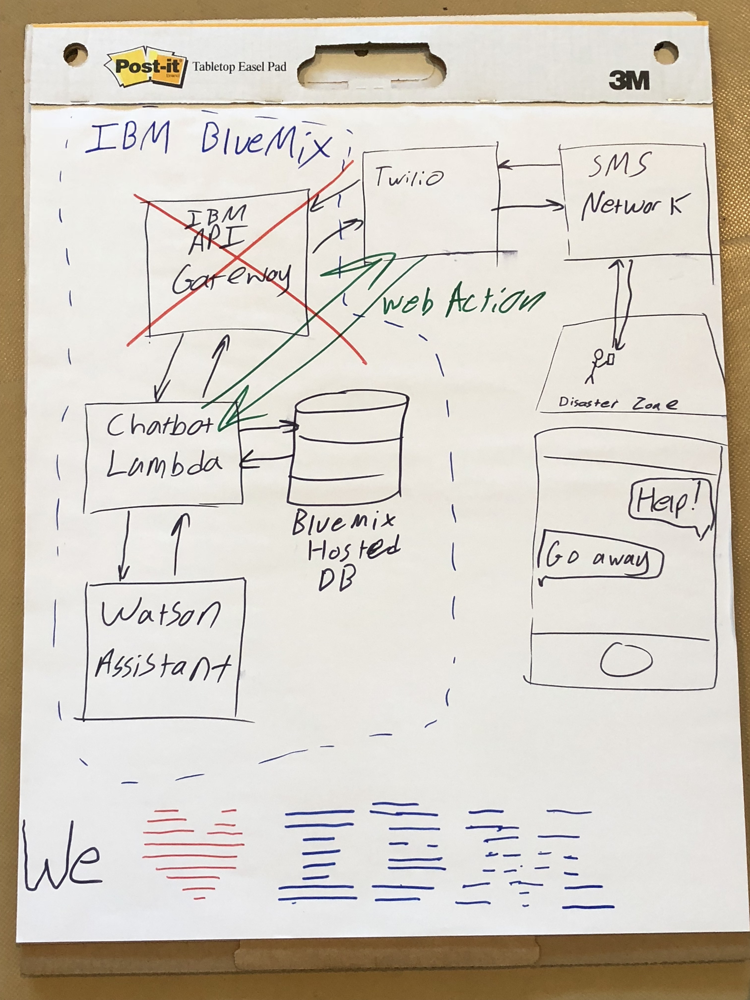
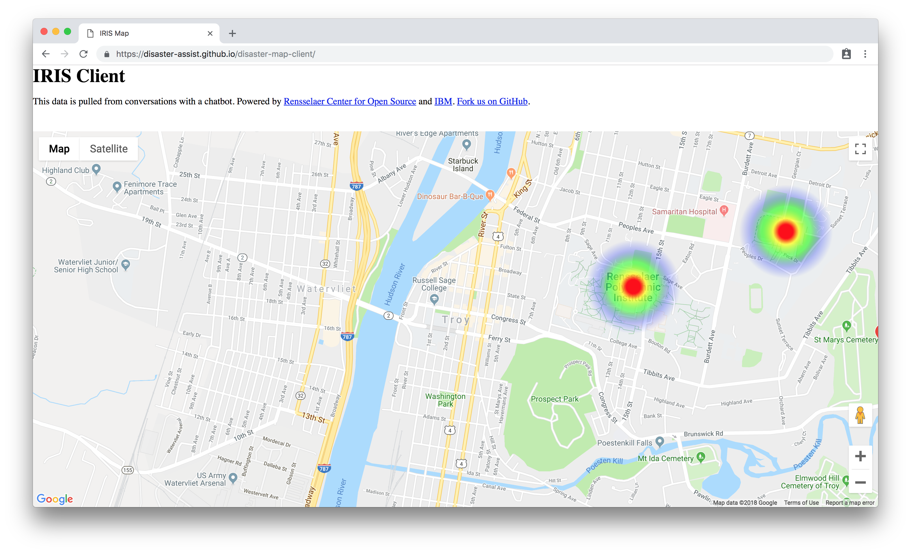
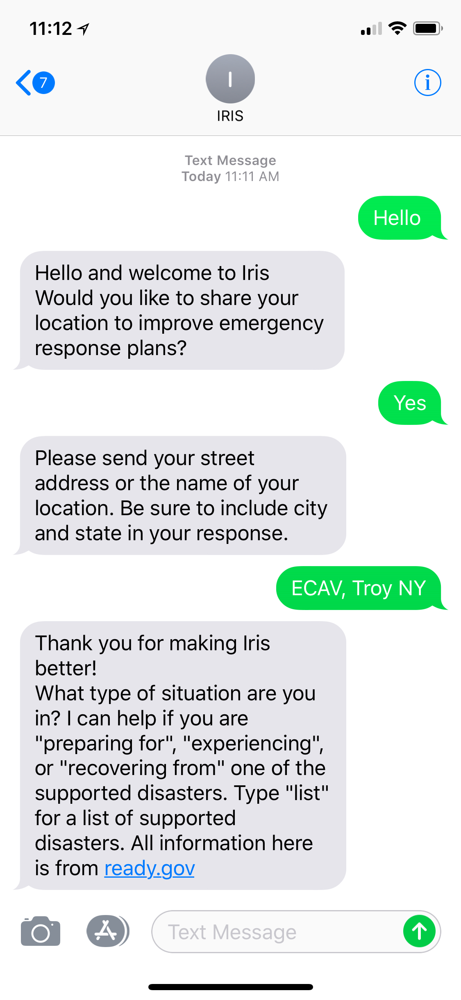

# IRIS

The IRIS project provides disaster-related information over SMS, and displays user-provided location data on a Google Maps overlay.

We have uploaded a copy of all of the source code to the submission Box folder. However, we highly recommend viewing this content on the GitHub organization.

[View the Organization on GitHub](https://github.com/disaster-assist)

## Components

[disaster-assist/twilio-watson-glue](https://github.com/disaster-assist/twilio-watson-glue) - Provides information via Twilio SMS using responses generated from IBM Watson.

[disaster-assist/disaster-map-client](https://github.com/disaster-assist/disaster-map-client) - Displays a Google Map with location markers pulled from a database

[disaster-assist/disaster-map-backend](https://github.com/disaster-assist/disaster-map-backend) - Serves location data to disaster-map-client

[disaster-assist/disaster-clustering](https://github.com/disaster-assist/disaster-clustering) - Runs a clustering algorithm on collected location data, providing the results to disaster-map-client

## Diagram

### Original Concept

### First Responder Interface

### Client User SMS Interface

### More

Powered by [Rensselaer Center for Open Source](http://rcos.io) and IBM. See more at the RCOS [https://github.com/rcos](https://github.com/rcos).

